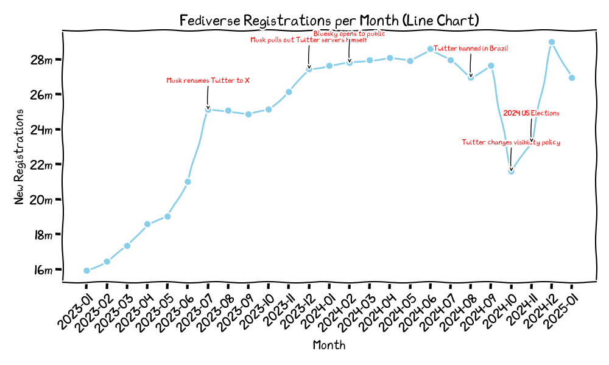

# Fediverse User Growth

Just a thrown together project to chart the fediverse user growth for a random tweet featuring that matplotlib has an XKCD style ^^"

* https://mastodon.online/@spielmannspiel/113929411275245438
* https://vxtitter.com/i/status/1885247693678928360

This is, by no means a piece of quality, more a hacked together (the RenderPlot.py even mostly ChatGPT generated for testing purposes) project for the request "doing it for the fediverse" https://mastodon.social/@mikolasan/113929923043450698 ^^"    



Source of Data:
* https://fediverse.observer/
* https://fediverse.observer/stats
* https://api.fediverse.observer/
* Manually set data-points: data/known_events.json


## Installation

Needs Python 10 or higher.

### Font

BEFORE executing for first time, install the XKCD font, if you wnt to use the drawn grapgh with the XKCD font that is.  
Font: https://github.com/ipython/xkcd-font/tree/master/xkcd/build  
Otherwise you have to clear the font cache yourself.  
```python
import matplotlib

print(matplotlib.get_cachedir())
```
### Requirements

```bash
virtualenv venv 
source venv/bin/activate
pip3 install -r requirements.txt
```